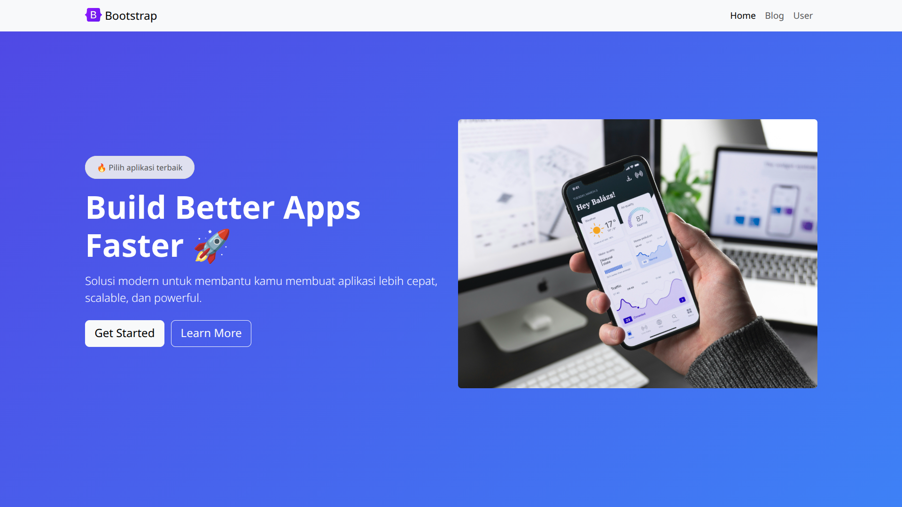
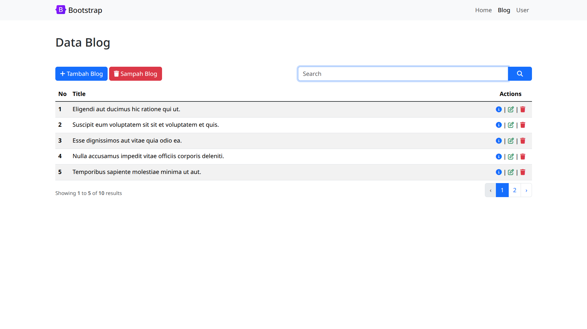
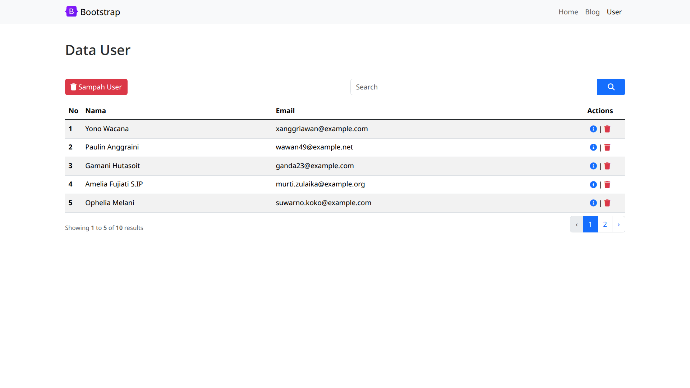

<p align="center"><a href="https://laravel.com" target="_blank"></a></p>


# 📝 BlogApp — Tugas Praktikum Pemrograman Web

Aplikasi blog sederhana berbasis **Laravel** yang mendemonstrasikan penggunaan **MVC Controller**, **Eloquent ORM**, **Soft Delete**, dan **Relasi Antar Model**.

---

## 📋 Deskripsi Proyek

**BlogApp** adalah aplikasi manajemen blog yang dibangun menggunakan framework Laravel. Aplikasi ini memungkinkan pengguna untuk:

- Melihat, membuat, mengedit, dan menghapus **artikel blog**
- Mengelola data **user** beserta profil mereka
- Menambahkan **komentar** pada artikel blog
- Menggunakan fitur **Soft Delete** (data masuk sampah sebelum dihapus permanen)
- Melakukan **restore** data dari tempat sampah

---

## 🗂️ Halaman Aplikasi (≥ 4 Halaman dengan Controller)

### 1. 🏠 Halaman Home
- **Route:** `GET /`
- **View:** `resources/views/public/home.blade.php`
- Halaman utama aplikasi sebagai landing page.

### 2. 📰 Halaman Blog (Daftar Artikel)
- **Route:** `GET /blog`
- **Controller:** `BlogController@index`
- **View:** `resources/views/public/blog.blade.php`
- Menampilkan seluruh artikel blog dengan fitur **pencarian** berdasarkan judul dan **pagination** (5 data per halaman).

### 3. 🔍 Halaman Detail Blog
- **Route:** `GET /blog/{slug}`
- **Controller:** `BlogController@detailBlog`
- **View:** `resources/views/public/detail_blog.blade.php`
- Menampilkan detail artikel beserta **komentar** dan **tags** yang terkait.

### 4. 👥 Halaman Data User
- **Route:** `GET /users`
- **Controller:** `UserController@index`
- **View:** `resources/views/public/user.blade.php`
- Menampilkan daftar user dengan relasi ke profil, dilengkapi pencarian dan pagination.

### 5. 👤 Halaman Detail User
- **Route:** `GET /user/{slug}`
- **Controller:** `UserController@detail`
- **View:** `resources/views/public/detail_user.blade.php`
- Menampilkan detail informasi user beserta data profilnya.

### 6. 🗑️ Halaman Sampah Blog
- **Route:** `GET /blog/trash`
- **Controller:** `BlogController@trash`
- **View:** `resources/views/public/blog_trash.blade.php`
- Menampilkan artikel yang telah di-soft delete, dengan opsi restore atau hapus permanen.

### 7. 🗑️ Halaman Sampah User
- **Route:** `GET /users/trash`
- **Controller:** `UserController@trash`
- **View:** `resources/views/public/user_trash.blade.php`
- Menampilkan user yang telah di-soft delete beserta profilnya.

---

## 🏗️ Struktur MVC

### Controllers

| Controller | Method | Fungsi |
|---|---|---|
| `BlogController` | `index` | Daftar blog + pencarian + pagination |
| `BlogController` | `detailBlog` | Detail satu artikel |
| `BlogController` | `create` | Simpan artikel baru (POST) |
| `BlogController` | `update` | Edit artikel (PATCH) |
| `BlogController` | `softDelete` | Hapus ke tempat sampah |
| `BlogController` | `trash` | Daftar sampah blog |
| `BlogController` | `trashDetail` | Detail blog di sampah |
| `BlogController` | `restore` | Pulihkan dari sampah |
| `BlogController` | `delete` | Hapus permanen |
| `UserController` | `index` | Daftar user + pencarian |
| `UserController` | `detail` | Detail user |
| `UserController` | `softDelete` | Hapus user ke sampah |
| `UserController` | `trash` | Daftar sampah user |
| `UserController` | `trashDetail` | Detail user di sampah |
| `UserController` | `restore` | Pulihkan user dari sampah |
| `UserController` | `delete` | Hapus user permanen |
| `CommentController` | `store` | Simpan komentar baru |

### Models & Relasi

```
User ──────────── hasOne ──────────── Profile
Blog ──────────── hasMany ─────────── Comment
Blog ──────────── belongsToMany ───── Tag
```

Semua model `User`, `Blog`, `Comment`, dan `Profile` menggunakan fitur **SoftDeletes**.

---

## 🛠️ Teknologi yang Digunakan

| Teknologi | Versi | Keterangan |
|---|---|---|
| PHP | 8.5+ | Bahasa pemrograman server-side |
| Laravel | 12.x | Framework PHP |
| PostgreSQL | 18 | Database |
| Laravel Sail | — | Docker environment untuk development |
| Blade | — | Template engine Laravel |
| Eloquent ORM | — | Object-Relational Mapping |

---

## 🚀 Cara Menjalankan Proyek

### Prasyarat
- [Docker Desktop](https://www.docker.com/products/docker-desktop/) sudah terinstall
- Composer sudah terinstall

### Langkah Instalasi

**1. Clone repository**
```bash
git clone https://github.com/frizennwave/blog-app.git
cd blogApp
```

**2. Copy file environment**
```bash
cp .env.example .env
```

**3. Install dependensi PHP**
```bash
composer install
```

**4. Jalankan dengan Laravel Sail (Docker)**
```bash
./vendor/bin/sail up -d
```

**5. Generate application key**
```bash
./vendor/bin/sail artisan key:generate
```

**6. Jalankan migrasi database**
```bash
./vendor/bin/sail artisan migrate
```

**7. (Opsional) Jalankan seeder**
```bash
./vendor/bin/sail artisan db:seed
```

**8. Buat symbolic link storage**
```bash
./vendor/bin/sail artisan storage:link
```

Aplikasi dapat diakses di: **http://localhost:8000**

---

## 📁 Struktur Direktori Penting

```
blogApp/
├── app/
│   ├── Http/
│   │   └── Controllers/
│   │       ├── BlogController.php     # CRUD Blog + Soft Delete
│   │       ├── UserController.php     # CRUD User + Soft Delete
│   │       └── CommentController.php  # Tambah Komentar
│   ├── Models/
│   │   ├── Blog.php      # Model blog dengan SoftDeletes & relasi
│   │   ├── User.php      # Model user dengan SoftDeletes
│   │   ├── Comment.php   # Model komentar
│   │   ├── Profile.php   # Model profil user
│   │   └── Tag.php       # Model tag
│   └── Providers/
├── resources/
│   └── views/
│       ├── layouts/
│       │   └── app.blade.php          # Layout utama
│       └── public/
│           ├── home.blade.php
│           ├── blog.blade.php
│           ├── detail_blog.blade.php
│           ├── blog_trash.blade.php
│           ├── detail_trash_blog.blade.php
│           ├── user.blade.php
│           ├── detail_user.blade.php
│           ├── user_trash.blade.php
│           └── detail_trash_user.blade.php
├── routes/
│   └── web.php            # Definisi semua route
├── compose.yaml           # Docker Compose (Laravel Sail)
└── README.md
```

---

## ✨ Fitur Utama

- ✅ **CRUD Blog** — Buat, baca, edit, hapus artikel
- ✅ **CRUD User** — Manajemen data user beserta profil
- ✅ **Komentar** — Tambah komentar pada artikel
- ✅ **Tag** — Blog memiliki banyak tag (Many-to-Many)
- ✅ **Soft Delete** — Data tidak langsung hilang, masuk ke tempat sampah
- ✅ **Restore** — Data dari sampah bisa dipulihkan
- ✅ **Pencarian** — Cari blog berdasarkan judul, user berdasarkan nama
- ✅ **Pagination** — Data ditampilkan 5 item per halaman
- ✅ **Slug** — URL ramah pengguna menggunakan slug otomatis
- ✅ **Validasi** — Input divalidasi sebelum disimpan ke database

---

## 📸 Screenshot

Home page


Blogs Page


Users Page


---

## 📄 Lisensi

Proyek ini dibuat untuk keperluan **tugas mata kuliah Pemrograman Web** dan tidak untuk dipublikasikan secara komersial.
